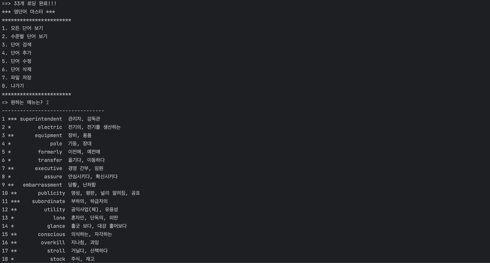
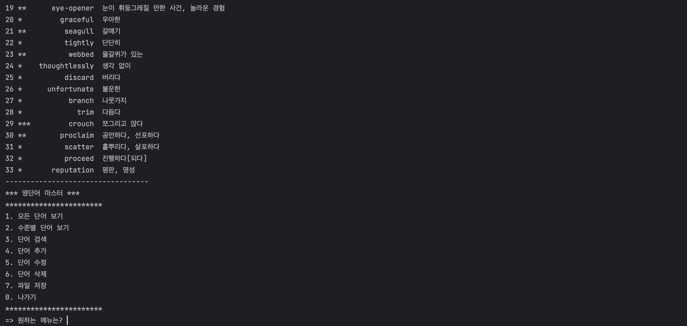

# **# Project1: WordMaster**

### < Class 구성 목록 >

- ICRUD : CRUD를 위한 interface
- Word : 데이터클래스
- WordCRUD : ICRUD interface 구현제
- WordManager : WordCRUD를 사용한 데이터 처리
- Main : static main 함수, starter class
   

### < 실행 결과 >

#### _1. 모든 단어 보기 기능_ 

  

#### _2. 수준별 단어 보기 기능_

  
#### _3. 단어 검색 기능_
*** 영단어 마스터 ***
***********************
1. 모든 단어 보기
2. 수준별 단어 보기
3. 단어 검색
4. 단어 추가
5. 단어 수정
6. 단어 삭제
7. 파일 저장
0. 나가기
***********************
=> 원하는 메뉴는? 3 
=> 원하는 단어는? st 
----------------------------------
1 **          stroll  거닐다, 산책하다 
2 *            stock  주식, 재고 
----------------------------------
  
#### _4. 단어 추가 기능_
*** 영단어 마스터 ***
***********************
1. 모든 단어 보기
2. 수준별 단어 보기
3. 단어 검색
4. 단어 추가
5. 단어 수정
6. 단어 삭제
7. 파일 저장
0. 나가기
***********************
=> 원하는 메뉴는? 4 
=> 난이도(1,2,3) & 새 단어 입력 : 2 electric field 
뜻 입력 : 전기장  
새 단어가 단어장에 추가되었습니다.  
*** 영단어 마스터 ***
***********************
1. 모든 단어 보기
2. 수준별 단어 보기
3. 단어 검색
4. 단어 추가
5. 단어 수정
6. 단어 삭제
7. 파일 저장
0. 나가기
***********************
=> 원하는 메뉴는? 1 
1 *** superintendent  관리자, 감독관 
2 *         electric  전기의, 전기를 생산하는 
3 **       equipment  장비, 용품 
4 *             pole  기둥, 장대 
5 *         formerly  이전에, 예전에 
6 *         transfer  옮기다, 이동하다 
7 **       executive  경영 간부, 임원 
8 *           assure  안심시키다, 확신시키다 
9 **   embarrassment  당황, 난처함 
10 **       publicity  명성, 평판, 널리 알려짐, 공표 
11 ***    subordinate  부하의, 하급자의 
12 **         utility  공익사업(체), 유용성 
13 *             lone  혼자인, 단독의, 외딴 
14 *           glance  흘긋 보다, 대강 훑어보다 
15 **       conscious  의식하는, 자각하는 
16 **        overkill  지나침, 과잉 
17 **          stroll  거닐다, 산책하다 
18 *            stock  주식, 재고 
19 **      eye-opener  눈이 휘둥그레질 만한 사건, 놀라운 경험 
20 *         graceful  우아한 
21 **         seagull  갈매기 
22 *          tightly  단단히 
23 **          webbed  물갈퀴가 있는 
24 *    thoughtlessly  생각 없이 
25 *          discard  버리다 
26 *      unfortunate  불운한 
27 *           branch  나뭇가지 
28 *             trim  다듬다 
29 ***         crouch  쪼그리고 앉다 
30 **        proclaim  공언하다, 선포하다 
31 *          scatter  흩뿌리다, 살포하다 
32 *          proceed  진행하다[되다] 
33 *       reputation  평판, 명성 
34 **  electric field  전기장 
----------------------------------
  
#### _5. 단어 수정 기능_
*** 영단어 마스터 ***
***********************
1. 모든 단어 보기
2. 수준별 단어 보기
3. 단어 검색
4. 단어 추가
5. 단어 수정
6. 단어 삭제
7. 파일 저장
0. 나가기
***********************
=> 원하는 메뉴는? 5 
=> 수정할 단어 검색 : st 
----------------------------------
1 **          stroll  거닐다, 산책하다 
2 *            stock  주식, 재고 
----------------------------------
=> 수정할 번호 검색 : 2 
=> 뜻 입력 : 주식, 재고, 상투적인  
단어가 수정되었습니다.  
*** 영단어 마스터 ***
***********************
1. 모든 단어 보기
2. 수준별 단어 보기
3. 단어 검색
4. 단어 추가
5. 단어 수정
6. 단어 삭제
7. 파일 저장
0. 나가기
***********************
=> 원하는 메뉴는? 1 
1 *** superintendent  관리자, 감독관 
2 *         electric  전기의, 전기를 생산하는 
3 **       equipment  장비, 용품 
4 *             pole  기둥, 장대 
5 *         formerly  이전에, 예전에 
6 *         transfer  옮기다, 이동하다 
7 **       executive  경영 간부, 임원 
8 *           assure  안심시키다, 확신시키다 
9 **   embarrassment  당황, 난처함 
10 **       publicity  명성, 평판, 널리 알려짐, 공표 
11 ***    subordinate  부하의, 하급자의 
12 **         utility  공익사업(체), 유용성 
13 *             lone  혼자인, 단독의, 외딴 
14 *           glance  흘긋 보다, 대강 훑어보다 
15 **       conscious  의식하는, 자각하는 
16 **        overkill  지나침, 과잉 
17 **          stroll  거닐다, 산책하다 
18 *            stock  주식, 재고, 상투적인 
19 **      eye-opener  눈이 휘둥그레질 만한 사건, 놀라운 경험 
20 *         graceful  우아한 
21 **         seagull  갈매기 
22 *          tightly  단단히 
23 **          webbed  물갈퀴가 있는 
24 *    thoughtlessly  생각 없이 
25 *          discard  버리다 
26 *      unfortunate  불운한 
27 *           branch  나뭇가지 
28 *             trim  다듬다 
29 ***         crouch  쪼그리고 앉다 
30 **        proclaim  공언하다, 선포하다 
31 *          scatter  흩뿌리다, 살포하다 
32 *          proceed  진행하다[되다] 
33 *       reputation  평판, 명성 
----------------------------------
  
#### _6. 단어 삭제 기능_
*** 영단어 마스터 ***
***********************
1. 모든 단어 보기
2. 수준별 단어 보기
3. 단어 검색
4. 단어 추가
5. 단어 수정
6. 단어 삭제
7. 파일 저장
0. 나가기
***********************
=> 원하는 메뉴는? 6 
=> 삭제할 단어 검색 : er 
----------------------------------
1 *** superintendent  관리자, 감독관 
2 *         formerly  이전에, 예전에 
3 *         transfer  옮기다, 이동하다 
4 **        overkill  지나침, 과잉 
5 **      eye-opener  눈이 휘둥그레질 만한 사건, 놀라운 경험 
6 *          scatter  흩뿌리다, 살포하다 
----------------------------------
=> 삭제할 번호 검색 : 5 
=> 정말로 삭제하실래요?(Y/n) y  
단어가 삭제되었습니다.  
*** 영단어 마스터 ***
***********************
1. 모든 단어 보기
2. 수준별 단어 보기
3. 단어 검색
4. 단어 추가
5. 단어 수정
6. 단어 삭제
7. 파일 저장
0. 나가기
***********************
=> 원하는 메뉴는? 1 
1 *** superintendent  관리자, 감독관 
2 *         electric  전기의, 전기를 생산하는 
3 **       equipment  장비, 용품 
4 *             pole  기둥, 장대 
5 *         formerly  이전에, 예전에 
6 *         transfer  옮기다, 이동하다 
7 **       executive  경영 간부, 임원 
8 *           assure  안심시키다, 확신시키다 
9 **   embarrassment  당황, 난처함 
10 **       publicity  명성, 평판, 널리 알려짐, 공표 
11 ***    subordinate  부하의, 하급자의 
12 **         utility  공익사업(체), 유용성 
13 *             lone  혼자인, 단독의, 외딴 
14 *           glance  흘긋 보다, 대강 훑어보다 
15 **       conscious  의식하는, 자각하는 
16 **        overkill  지나침, 과잉 
17 **          stroll  거닐다, 산책하다 
18 *            stock  주식, 재고 
19 *         graceful  우아한 
20 **         seagull  갈매기 
21 *          tightly  단단히 
22 **          webbed  물갈퀴가 있는 
23 *    thoughtlessly  생각  
24 *          discard  버리다 
25 *      unfortunate  불운한 
26 *           branch  나뭇가지 
27 *             trim  다듬다 
28 ***         crouch  쪼그리고 앉다 
29 **        proclaim  공언하다, 선포하다 
30 *          scatter  흩뿌리다, 살포하다 
31 *          proceed  진행하다[되다] 
32 *       reputation  평판, 명성 
----------------------------------
  
#### _7. 파일 저장 기능_

  
#### _0. 나가기 기능_
*** 영단어 마스터 ***
***********************
1. 모든 단어 보기
2. 수준별 단어 보기
3. 단어 검색
4. 단어 추가
5. 단어 수정
6. 단어 삭제
7. 파일 저장
0. 나가기
***********************
=> 원하는 메뉴는? 0 
프로그램 종료 
