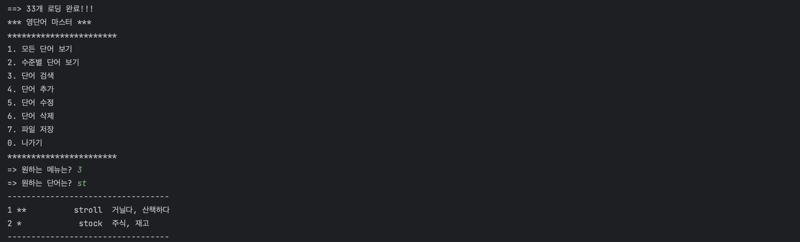
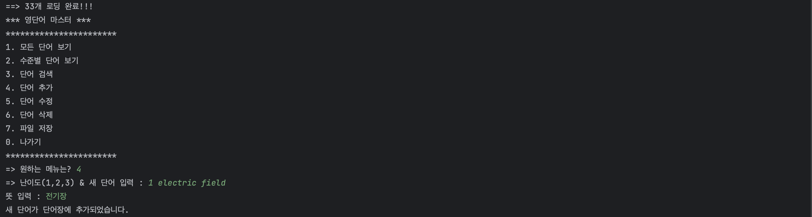
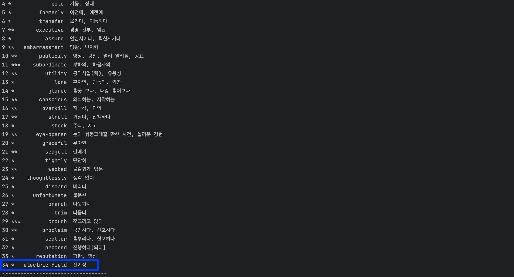
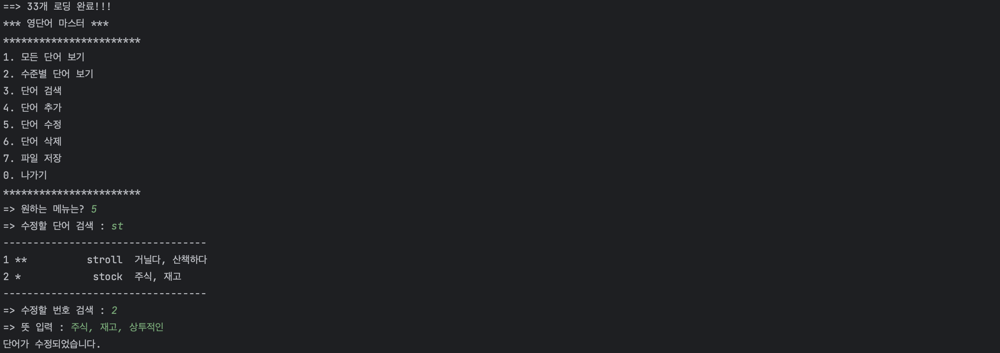
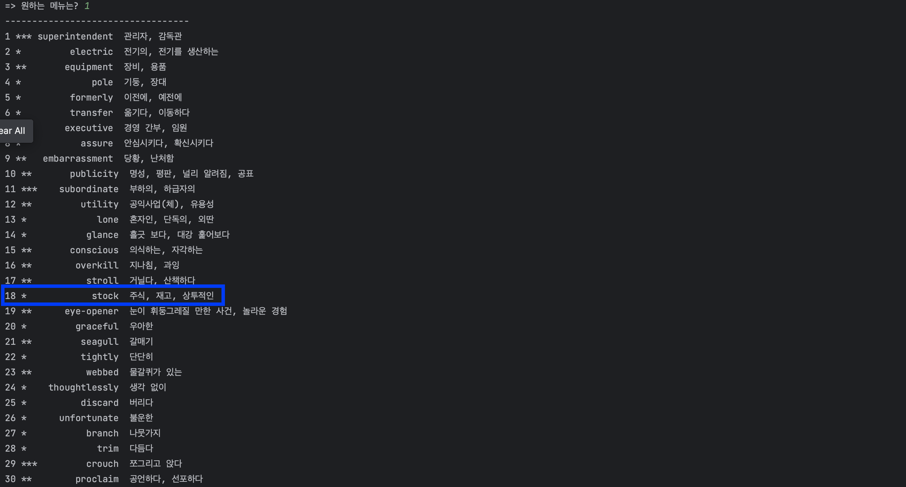
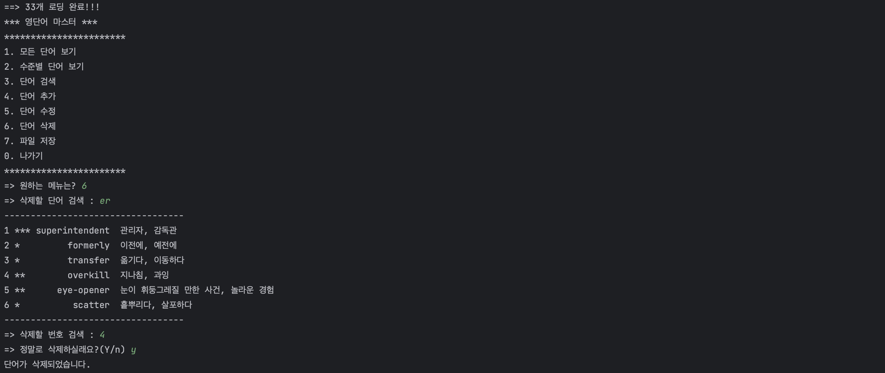
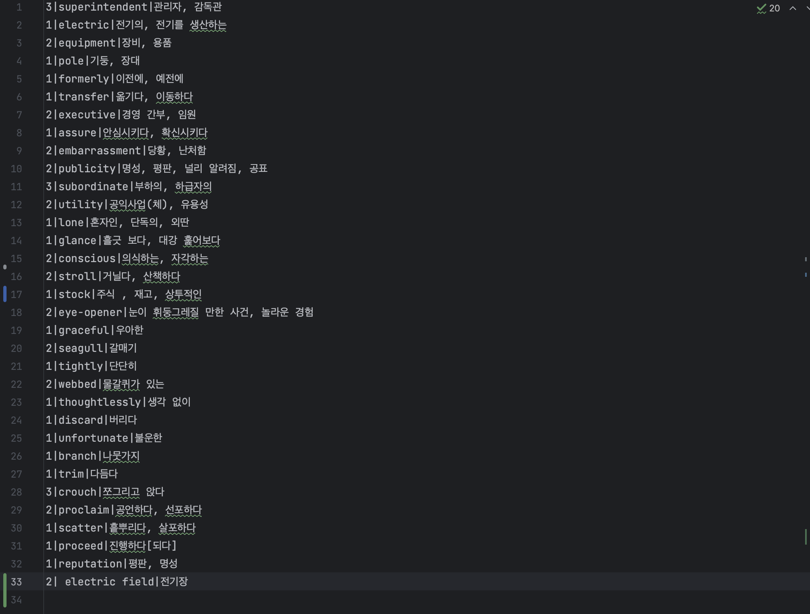
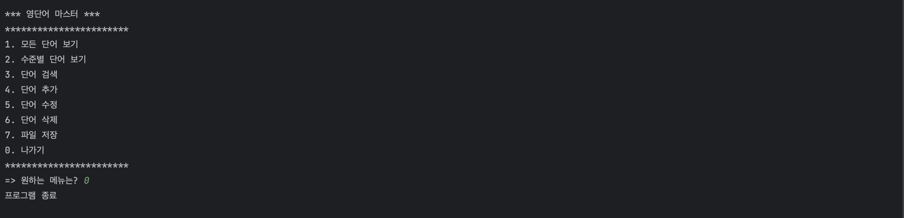

# **# Project1: WordMaster** 
 
### Program 설명 
#### 제작 목적: Java는 객체지향 프로그래밍 언어로서, 프로그램을 모듈화하고 관리하게 용이하다. 단어장 프로그램은 다양한 객체(예: 단어 등)이 필요하거나 구성될 수 있고, 객체지향 프로그래밍 원칙을 적용하여 코드를 보다 체계적으로 작성할 수 있다. 구현된 기능과 객체는 대학생이 많이 접하고 사용할 수 있는 단어장 프로그램으로 하였다. 이 프로젝트를 통해 객체지향 프로그램, interface 등 자바프로그래밍 언어의 특징을 이해하고 GitHub 사용을 익히는 데에 목적이 있다. 
 
#### 개발 환경: IDE – InteliJ / JDK – Orackle 17 version / OS – Mac OS Big Sur 
 
#### 구현한 기능 목록과 설명: 단어장의 CRUD 기능을 구현 
1.	Create: WordCRUD.add(), WordCRUD.addItem(), WordCRUD.saveFile() 
2.	Read: WordCRUD.listAll(), WordCRUD.listAll(int level), WordCRUD.loadFile() 
3.	Update: WordCRUD.updateItem() 
4.	Delete: WordCRUD.deleteItem() 
  
### 개발세부사항 
#### 프로그램에서 사용한 Java class 목록과 사용 내용 (in JDK) 
1.	java.io*: Java에서 입력과 출력 관련 작업을 수행하기 위한 클래스와 인터페이스를 제공하는 패키지.  
  i.	FileReader: 파일에서 문자 데이터를 읽을 때 사용된다. WordCRUD 클래스의 loadFile()에서 사용 
  ii.	BuffferedReader: DataInputStream을 버퍼링하여 loadFile()에서 사용 
  iii.	FileWriter: WordCRUD 클래스의 saveFile()에서 파일에 문자 데이터를 쓸 때 사용 
  iv.	PrintWriter: WordCRUD 클래스의 saveFile()에서 텍스트 데이터를 출력할 때 사용 
  v.	IOException: WordCRUD 클래스의 loadFIle()와 saveFIle()에서 입출력 작업 중 발생할 수 있는 예외를 처리하기 위한 예외 클래스 
2.	java.util.ArrayList: 동적 배열 구조의 클래스.  
3.	java.util.Scanner: 데이터를 읽기 위한 클래스. next(), nextInt(), nextLine()과 같은 method를 사용하여 다양한 데이터 유형을 읽는다. 
  i.	Word 객체를 저장하는 List라는 이름의 ArrayList 객체 선언 
 
####	프로그램에서 새로 만든 Java class / Interface 목록과 설명 
1.	ICRUD : CRUD를 위한 interface 
2.	Word : 데이터클래스 
3.	WordCRUD : ICRUD interface 구현제 
  i.	listAll(): 모든 단어 보기 기능. list를 한 줄씩 출력 
  ii.	listAll(String keyword): 단어 검색 기능. 문자를 입력하면 해당하는 문자가 있는 단어 ArrayList 출력 
  iii.	listAll(int level): 레벨 검색 기능. 레벨을 입력하면 레벨에 해당하는 단어 list를 출력 
  iv.	searchLevel(): 수준별 단어 보기 기능. listAll(int level) method를 이용하여 해당 list를 출력 
  v.	add(): 단어 추가 기능. 난이도와 단어, 의미를 입력하도록 함 
  vi.	addItem(): add() method에서 입력한 단어를 list에 추가 
  vii.	updateItem(): 단어 수정 기능. listAll(String keyword)를 통해 수정하고 싶은 단어를 수정 
  viii.	deleteItem(): 단어 삭제 기능. listAll(String keyword)를 통해 삭제하고 싶은 단어를 삭제 
  ix.	loadFile(): “Dictionary.txt”에 들어있는 레벨, 단어, 의미를 ‘|’로 구분하여 list에 저장 
  x.	saveFIle(): 실행을 통한 단어장 변경사항을 다시 “Dictionary.txt”에 저장 
 
4.	WordManager : WordCRUD를 사용한 데이터 처리 
  
### < Class 구성 목록 > 
- ICRUD : CRUD를 위한 interface 
- Word : 데이터클래스 
- WordCRUD : ICRUD interface 구현제 
- WordManager : WordCRUD를 사용한 데이터 처리 
- Main : static main 함수, starter class 
 

### < 실행 결과 > 
#### _1. 모든 단어 보기 기능_  

  

#### _2. 수준별 단어 보기 기능_ 

  

#### _3. 단어 검색 기능_

  

#### _4. 단어 추가 기능_ 

  

#### _5. 단어 수정 기능_

  

#### _6. 단어 삭제 기능_

  

#### _7. 파일 저장 기능_

  

#### _0. 나가기 기능_

