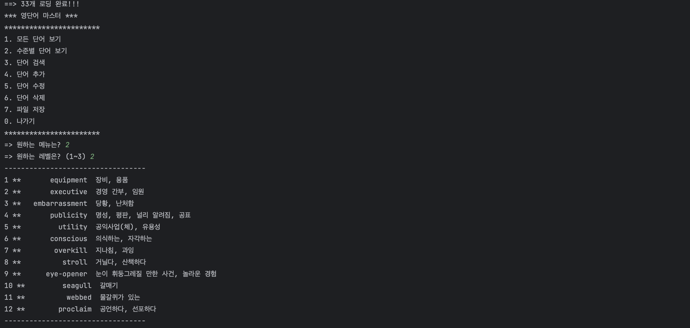

# **# Project1: WordMaster**

### < Class 구성 목록 >

- ICRUD : CRUD를 위한 interface
- Word : 데이터클래스
- WordCRUD : ICRUD interface 구현제
- WordManager : WordCRUD를 사용한 데이터 처리
- Main : static main 함수, starter class
   

### < 실행 결과 > 
#### _1. 모든 단어 보기 기능_  

  

#### _2. 수준별 단어 보기 기능_ 

  

#### _3. 단어 검색 기능_

  

#### _4. 단어 추가 기능_ 

  

#### _5. 단어 수정 기능_

  

#### _6. 단어 삭제 기능_

  

#### _7. 파일 저장 기능_

  

#### _0. 나가기 기능_

